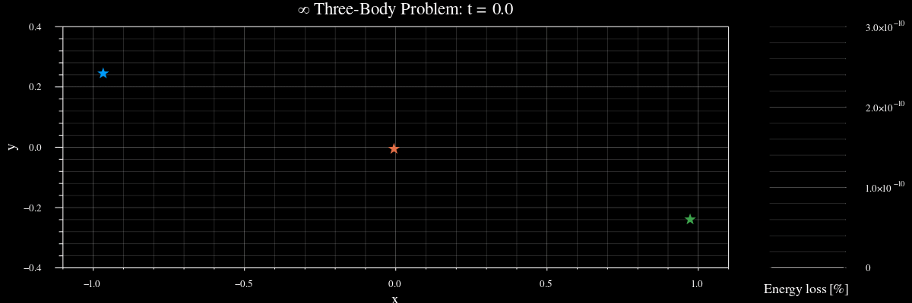
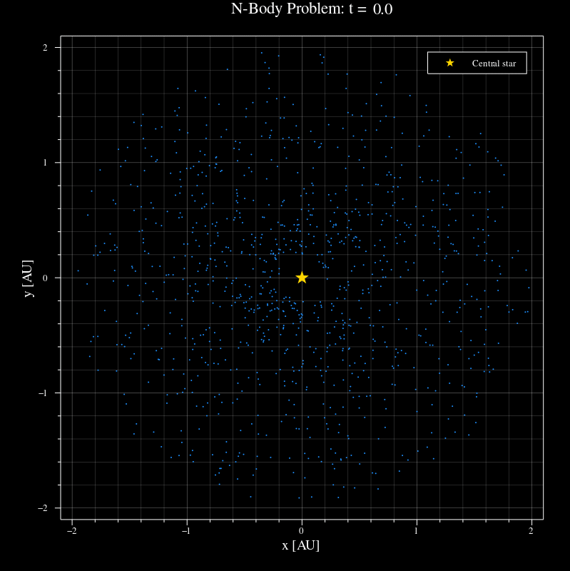

# Numerics Tutorial

The notebook here walks through the process of building up a simple n-body solution generator from scratch! It also focuses on explaining the methodology behind the code with error analysis and discussion. Below are some of the cool things it produces / will teach you how to make:

1. The famous "figure-eight" three-body solution!

2. How to do simple chaos-theory analysis of what changes to initial conditions do to the stability of a solution like this:

3. How to simulate systems of n-bodies, including a chaotic toy early solar system filled with planetesimals! 

There's a lot more info in the notebook. You'll need to have Julia and Jupyter installed, and your Jupyter notebook installation will need to know about Julia for you to be able to run the code. 

Have fun!
