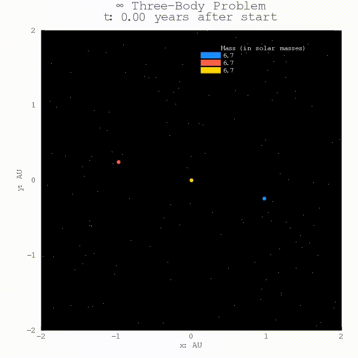

# Random Three-Body Simulation Generator (***with Twitter bot***)



A cool stable solution to the three-body problem created by the code, based off of [Chenciner and Montgomery (2000)](https://arxiv.org/pdf/math/0011268.pdf). See all the animations on the bot's [Twitter](https://twitter.com/ThreeBodyBot)!

### What people are saying about @ThreeBodyBot:

"I'm Jessie Christiansen and I stan the Random Three Body Problem twitter account." – [Dr. Jessie Christiansen](https://twitter.com/aussiastronomer/status/1263121973082681347)

"Mesmerizing bot" – [Emily Lakdawalla](https://twitter.com/elakdawalla/status/1263075152691990533)

"is this trisolaran propaganda" – [adam from Twitter](https://twitter.com/gains_tweets/status/1263103612168712194)

"shit I should really improve this code now that people other than me might look at it" – [@ThreeBodyBot's inept parent](https://www.kirklong.space)

<br/><br/>

### The three-body simulation generator
This is a fun little pet project I put together in Julia that renders a random gravitational three-body simulation in two dimensions. It's a simple program that uses an explicit implementation of fourth order Runge-Kutta with a fixed step size to simulate the system over a specified timescale. In addition to stopping after a specified amount of time, the simulation will quit if there is a collision between bodies or one or more bodies is ejected from the system. It then makes a pretty animation (complete with randomly generated fake background stars!) and saves it locally. This thing is now pretty much finalized, or at least at v1.0.


### New and exciting! Introducing n-body generator...
There are several scripts in the `nbody` folder worth looking at if you are looking to create even more gravitational chaos. These will start occasionally popping up on the bot's Twitter (currently a 1 in 10 chance each day), and there are new instructions below that should get you started if you want to try to make one of these yourself! The camera implementation with these is still a little buggy though...so if you have great ideas on what should be done to improve it please do so and I will happily credit and merge your changes. I think I can apply the improved camera system from the three-body versions here, but I need to actually sit down and spend a day doing it...

### The Twitter bot
This is my first experience with JavaScript and the Twitter API, so it's mostly cobbled together code from the Twit [documentation](https://www.npmjs.com/package/twit), this auto-tweeting image bot [code](https://github.com/fourtonfish/random-image-twitterbot/blob/master/server-attribution.js), and this video tweeting example from [Loren Stewart](https://lorenstewart.me/2017/02/03/twitter-api-uploading-videos-using-node-js/).

It's a really basic program but it works (mostly anyways).

To tweet from a script you need a developer account with Twitter so that you can fill in API keys (see `configSample.js`).

## Want to generate your own animations?

***Overwhelmed by lots of instructions and want me to just do it for you?*** DM the bot a donation receipt showing you supported an org fighting for civil rights  (ie places like the [Equal Justice Initiative](https://eji.org/), [Human Rights Campaign](https://www.hrc.org/), [ACLU](https://www.aclu.org/), etc.)  and I will do the heavy lifting for you! I will happily make you a classic three-body version, a 3D three-body version, or you can request one of my new fancy new n-body simulations – you can even pick colors and name the stars!  ***Now back to the details...***

If you're on Windows, there's now a 15 minute [tutorial video](https://www.youtube.com/watch?v=bXrXwgC9Ltk&feature=youtu.be) that walks you through the entire process, from installing Julia to making your first animation! If there's interest I will also make one demonstrating the process on Linux, but I'm assuming most people who are running Linux won't need/want a tutorial. Unfortunately I don't have access to a Mac, so can't make one for macOS. Hopefully between the Windows video and the instructions below you can sort it out, sorry!

To make the classic three-body animations with this code all you really need to download (in addition to Julia) is the `threeBodyProb.jl` script. There are comments there that hopefully explain how to use it and change the options so that you can start generating your own interesting systems! If you want to specify initial conditions (instead of having them be randomly generated) this script should be easy to modify to accomplish that goal.

A simple first thing to do would be to launch a Julia terminal window in the same directory as you've downloaded the script to, make a subdirectory called "tmpPlots", then at the REPL type ```include("threeBodyProb.jl")```. Then after that finishes running typing ```makeAnim()``` in that same terminal window should generate the animation, assuming you have FFmpeg installed. To make another animation you could then type ```main()``` to generate the frames again, then ```makeAnim()``` to compile another animation, and so on and so forth.

If you don't have FFmpeg installed you could try using Julia's built-in animation suite – I used to do it this way, and the "legacy" code is still there at the bottom of the script, but you'll have to do some tinkering to get it to play nice, and you won't be able to do the cool collision cam without some heavy modification. There are comments in the script that hopefully point this out / guide you on what you would need to do if you want to do this. For more advanced control over how the animations and to take advantage of all the coolest features are generated you will need to generate the animation frames using the fancier method (default, see above) with `makeAnim()` – by default it assumes there is an empty subdirectory called "tmpPlots" it can place the png files that you'll either need to create, or alternatively modify the code to remove that bit. The FFmpeg method also generates the frames and renders the animation ***significantly*** faster than the buil-in suite does, at least in older versions of Julia (haven't used it in a while). It's on my "someday" to-do list to turn this into an actual binary "app" that you could run without even having Julia installed, but until that happens you have to get a little bit into the weeds, sorry! There is a nice set of instructions at the top of `threeBodyProb.jl` that should help you get up and running though, and once you have that working if you want to use the other scripts it should be easy to incorporate.  

The `3BodySetup.ipynb` notebook is more of the stream of consciousness I had while creating this project and testing different things, but it may be useful if you want to see how things are tweaked (but it's not very well documented sorry).

The shell script (`3BodyShell.sh`) depends almost entirely on filepaths to my machine and requires use of the Twitter API through the `server.js` script but is a good template to base your own off of (if you desire), and the FFmpeg command there by itself may be useful. It's also fun if you just want to see the entire pipeline for how the animations get generated and posted start to finish.

**If you want to make n-body simulations**, you need either the `requests.jl` or `namedBody.jl` code from the `nbody` folder – use the `namedBody.jl` version if you want to give the stars actual names (as opposed to just masses) and the `requests.jl` version for everything else. Yes, reader, I could (and probably should) have combined these into one file but I'm exceptionally lazy and for some reason thought it was easier to make two when I did it late the other night so sorry. Both of these scripts have command line arguments that change interactivity. For example, to generate square frames for a 10 body simulation with random masses, colors, and without fun names one would execute something like `julia requests.jl 10 0 0 0`. Like in the three-body code you will need to alter the filepath to where the frames are saved, and use something like FFmpeg to compile the frames after they are generated. 

### Prerequisites

To run the Julia code you will need [Julia](https://julialang.org/downloads/platform.html) installed on your machine and within Julia you will need the Plots, Random, and Printf [packages installed](https://docs.julialang.org/en/v1/stdlib/Pkg/index.html). If you want to run the Jupyter Notebook you will also need to have the [IJulia package](https://github.com/JuliaLang/IJulia.jl).

To tweet the animations from the server.js script you will need a developer account and an application with keys you can populate to the `configSample.js` file. [This](https://www.makeuseof.com/tag/photo-tweeting-twitter-bot-raspberry-pi-nodejs/) is a helpful tutorial I loosely followed. You will need [Node.js](https://nodejs.org/en/download/) installed with the package [Twit](https://www.npmjs.com/package/twit) added.

To create the animation (either in Julia or manually) with this script you need to have [FFmpeg installed](https://ffmpeg.org/download.html).

### Errors

If the animation does not render correctly, the most likely culprit is you do not have FFmpeg installed correctly (see above). If you are running on Windows/MacOS there may be minor things that might have to be changed for your system, especially if you are trying to use the more advanced options.

On my machine initially the animations failed to build if they had more than 1024 frames due to a restriction on the number of open files. On Linux you can fix this by typing the following into a terminal:


```
ulimit -n 4096
```

The default hard limit is usually 4096, and that should be ample for most animations. Note that this will only affect the current shell and will not change the limit permanently. To do that you will need to [alter your /etc/security/limits.conf file](https://sysadminxpert.com/change-ulimit-values-permanently-for-a-user-or-all-user-in-linux/).

If this doesn't work, check what your hard limit is specified as:

```
ulimit -Hn
```

You can modify the hard limit in the /etc/security/limits.conf file mentioned above if needed (you will probably need to if you are making animations longer than 4096 frames/~2.5 min at 30 fps).


## Built With

* [Julia](https://julialang.org/) – to simulate the system and create the animation frames.
* [FFmpeg](https://ffmpeg.org/) – to render the animations and integrate audio files.
* [Node.js](https://nodejs.org/en/) – to post the animations to Twitter (with the help of [twit](https://www.npmjs.com/package/twit)).
* [Bash](https://www.gnu.org/software/bash/) – to pull all scripts together and manage the resulting files.


## Author

 **Kirk Long**


## Acknowledgments

* Incredibly grateful for the Node.js examples used in creating the Twitter bot already mentioned above.

* Also grateful for Dr. Olga Goulko, whose class I took Fa2018 enabled me to develop the skills to put together a project like this – parts of this Julia code were repurposed from my final project in her class, where I generated a Saturn V physics simulation in Python.

* To create this README I followed this excellent [template](https://gist.github.com/PurpleBooth/109311bb0361f32d87a2).

* Thanks to [Hunter Coleman](https://twitter.com/hunto_cole) for noticing a minor error in the initCondGen() function where distances were calculated improperly.

* Thanks to [Tasos Papastylianou](https://stackoverflow.com/users/4183191/tasos-papastylianou) for his help in [debugging](https://stackoverflow.com/questions/59515953/julia-program-stalls-when-run-from-crontab-scheduler-linux?noredirect=1#comment105234026_59515953) a very tricky error when my program was not running correctly initially when scheduled with cron.

* Thanks to my research advisor Dr. Daryl Macomb for not answering my questions right away, giving me the free time over winter break to initially create this bot.

* Musical selections that accompany animations:

  1. [Adagio for Strings – Barber](https://www.youtube.com/watch?v=tVNhFMZP4NM)

  2. [The Blue Danube Waltz – Strauss](https://www.youtube.com/watch?v=cKkDMiGUbUw)

  3. Moonlight Sonata (1st Movement) – Beethoven (recorded by me)

  4. Clair de Lune – Debussy (recorded by me)

  5. Gymnopédie No. 1 – Satie (recorded by me)

  6. [Symphony No. 5 – Beethoven](https://www.youtube.com/watch?v=_4IRMYuE1hI)

  7. First Step (from the Interstellar soundtrack) – Zimmer (piano cover and recording by me)

  8. Time (from the Inception soundtrack) – Zimmer (piano cover and recording by me)

  9. [I Need a Ride (from The Expanse season 3 soundtrack) – Shorter](https://www.youtube.com/watch?v=sbWmzoL4FwM)
  
  10. Prelude in E Minor – Chopin (recorded by me)
  
  11. Nocturne in C# Minor (Posthumous) – Chopin (recorded by me)
  
  12. Battlestar Sonatica (from the Battlestar Galactica season 3 soundtrack) – McCreary (recorded by me)
  
  13. Rhapsody in Blue (solo piano version) – Gershwin (recorded by me)
  
  14. Passacaglia (from the Battlestar Galactica season 2 soundtrack) – McCreary (piano cover recorded by me)
  
  15. Prelude in G Minor – Rachmaninoff (recorded by me)
  
  16. Prelude in C# Minor – Rachmaninoff (recorded by me)
  
  17. The Shape of Things to Come (from the Battlestar Galactica season 2 soundtrack) – McCreary (piano cover recorded by me)
  
  18. Prelude in C Major – Bach (recorded by me)
  
  19. Liebestraum – Liszt (recorded by me)
  
  20. Where is My Mind – Pixies (piano cover by Maxence Cyrin, recorded by me)
  
  21. Lost (from The Expanse season 2 soundtrack) – Shorter (piano cover and recording by me)
  
  22. What Did You Do (from The Expanse season 2 soundtrack) – Shorter (piano cover and recording by me)
  
  23. [Waltz of the Flowers – Tchaikovsky](https://www.youtube.com/watch?v=QxHkLdQy5f0)
  
**Disclaimer:** Although I think this project justifiably falls under fair use (purely educational/no money involved/only short snippets used) I have attempted to contact everyone who might have a copyright issue with this anyways in the name of good faith – they have either not replied or granted permission for this limited use. I've also tried to record my own versions of all pieces used (when possible), putting my music minor to good use and hopefully further mitigating any copyright issues. That being said, if you are the copyright owner to any of these tracks (particularly the movie/TV ones) and you do not want them used in the animations I will happily remove them as an option for the bot at your request.
